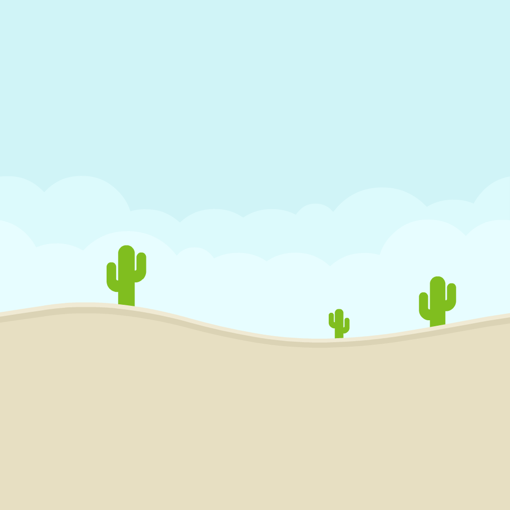
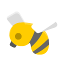
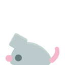
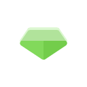

## Git và Github cho sysadmin

### Mục lục

[I. Mở đầu](#Modau)

- [1. Tổng quan](#tongquan)
- [2. Các thành phần của game](#cacthanhphancuagame)

  - [2.1. Nhân vật](#21nhanvat)
  - [2.2. Quái vật](#22quai)
  - [2.3. Vật phẩm](#23vatpham)

[II. Ngôn ngữ Python](#ngonngupython)

[III. Các thao tác với git và github](#caccongnghesudungtronggame)

- [1. Acarde](#arcade)
- [2. Socket](#socket)

[Tổng kết](#Tongket)

===========================

<a name="Modau"></a>

## I. Mở đầu

`GeaMonkee-Adventure`

- Là game được viết bằng ngôn ngữ `Python` và sử dụng phiên bản: _`3.9.13 64-bit`_
- Và thuộc thể loại **Platform game**. Đây là một thể loại game điện tử và cũng là một phần của game hành động. Mục đích cốt lõi của tất cả game đi cảnh là người chơi sẽ điều khiển nhân vật trong game vượt qua các chướng ngại vật trong game bằng cách leo trèo, nhảy xa, đu dây và tiêu diệt.
  Các cấp độ và môi trường sẽ càng ngày càng khó với những môi trường với địa hình phức tạp cùng những dạng quái vật mới, đòi hỏi thao tác điêu luyện từ người chơi.

<a name="tongquan"></a>

### 1. Tổng quan

BACKGROUND CỦA GAME ĐƯỢC CHIA THÀNH 4 MÙA

<div style="width: 26% ;display:flex; margin:auto 0">




</div>

<a name="cacthanhphancuagame"></a>

### 2. Cách thành phần của game

<a name="21nhanvat"></a>

#### 2.1 Nhân Vật

<div style="width: 100% ;display:flex; margin:auto 0; justify-content: center;flex-wrap: wrap">


</div>

<a name="22quai"></a>

#### 2.2 Quái Vật

<div style="width: 100% ;display:flex; justify-content: center;flex-wrap: wrap">







</div>

<a name="23vatpham"></a>

#### 2.3 Vật Phẩm

<div style="width: 100% ;display:flex; margin:auto 0; justify-content: center;flex-wrap: wrap">





</div>

<a name="ngonngupython"></a>

## II. Ngôn ngữ Python


Python là ngôn ngữ lập trình máy tính bậc cao thường được sử dụng để xây dựng trang web và phần mềm, tự động hóa các tác vụ và tiến hành phân tích dữ liệu.

Python là ngôn ngữ có mục đích chung, nghĩa là nó có thể được sử dụng để tạo nhiều chương trình khác nhau và không chuyên biệt cho bất kỳ vấn đề cụ thể nào. Bạn có thể đọc [tại đây](https://www.python.org/doc/) để biết cách sử dụng.

<a name="caccongnghesudungtronggame"></a>

## III. Các công nghệ được sử dụng trong game

<a name="arcade"></a>

### 1. Arcade


#### Thư viện Arcade trong Python là một thư viện dễ học, được sử dụng để tạo ra các trò chơi video 2D. Nó rất lý tưởng cho những người đang học lập trình hoặc các nhà phát triển muốn lập trình một trò chơi 2D mà không cần học một framework phức tạp.

**Nền tảng, công dụng và cách cài đặt:**

- Arcade được xây dựng trên Pyglet và OpenGL2. Nó chạy trên Windows, Mac OS X và Linux

- Arcade cung cấp một giao diện thân thiện và trực quan để xử lý các nhiệm vụ phát triển trò chơi, bao gồm xử lý đầu vào, hiển thị và âm thanh. Với Arcade, bạn có thể dễ dàng xây dựng các trò chơi với hình ảnh động, tương tác người chơi và phát hiện va chạm

- Để cài đặt thư viện này, bạn chỉ cần chạy lệnh sau trên cửa sổ dòng lệnh của bạn:

```sh
pip install arcade
```

<a name="socket"></a>

### 2. Socket


<a name="socket"></a>

#### Thư viện `socket` trong Python cung cấp một giao diện mạng cấp thấp1. Nó cung cấp quyền truy cập vào giao diện socket BSD và có sẵn trên tất cả các hệ thống Unix hiện đại, Windows, MacOS và có thể nhiều nền tảng khác

**Nền tảng, công dụng và cách cài đặt:**

- Giao diện Python là một bản dịch trực tiếp của hệ thống gọi và giao diện thư viện cho các socket theo phong cách định hướng đối tượng của Python: hàm `socket()` trả về một đối tượng socket mà các phương thức của nó thực hiện các cuộc gọi hệ thống socket khác nhau

- Thư viện socket được sử dụng để gửi tin nhắn qua mạng. Chúng cung cấp một hình thức giao tiếp giữa các tiến trình (IPC). Mạng có thể là một mạng logic, mạng cục bộ đối với máy tính, hoặc một mạng được kết nối vật lý với một mạng bên ngoài, với các kết nối riêng của nó đến các mạng khác.

- Để sử dụng thư viện socket thì trong `Python`:

```python
import socket
```

<a name="Tongket"></a>

## Tổng kết

Đây là toàn bộ nội dung tổng quát nhất về GeaMonkee-Adventure.

Hy vọng bạn cài đặt đầy đủ packages trước khi chơi game và có trai nghiệm tốt nhất.

Liên lạc với chúng tôi khi bạn cần:

- Email:
  - quocvi1701@gmail.com
  - trinhq011@gmail.com
  - shikigamimaito25@gmail.com
  - nghkhoinguyen2404@gmail.com

Xin chân thành cảm ơn!
